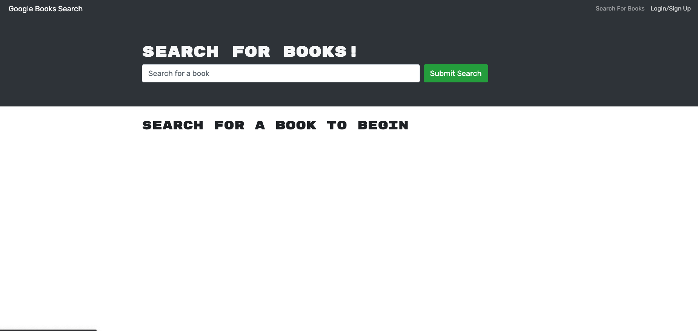
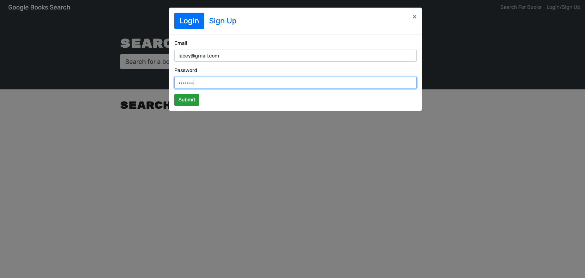
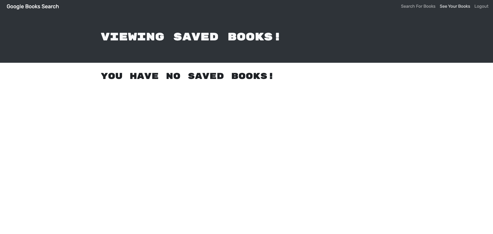
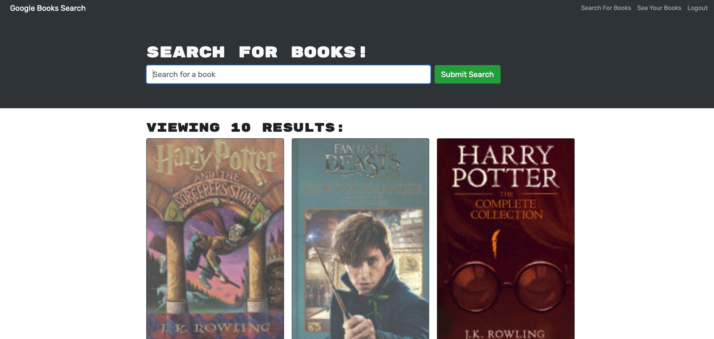
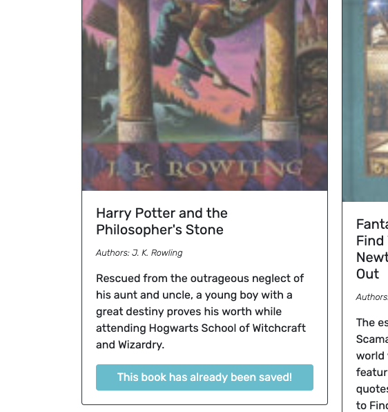
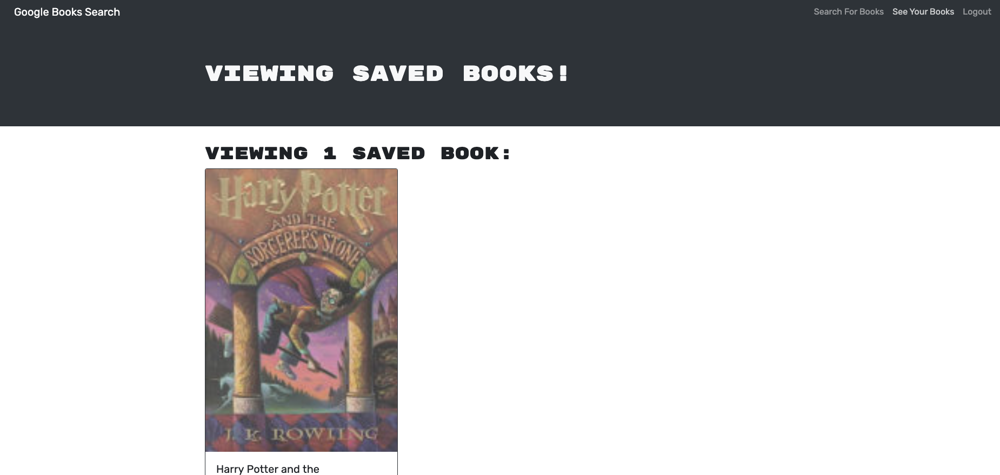
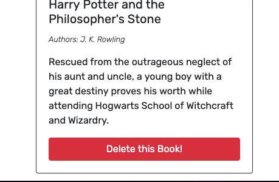

# Book Search Engine

## Description
This application was developed to help avid readers save books into a collection and search various terms to find new books.

----
## Table Of Contents
* [Usage](#usage)
* [Contributions](#contributions)
* [Questions](#questions)
* [Screenshots](#screenshots)

----
## Usage
Visit the deployed application by clicking [here](https://still-journey-79334.herokuapp.com/)

----
## Contributors
* Starter code provided by The Coding Bootcamp
* [Lacey Griffith](https://github.com/lacey-griffith) contributed code for implementing the Apollo Server, applying middleware, mutations and queries to fetch the GraphQL API and deploying to Heroku.

----
## Questions
If you have any questions please contact me at lacey.griffith04@gmail.com.
You can also visit my GitHub profile by clicking [here](https://github.com/lacey-griffith) and the repository for this project can be found [here](https://github.com/lacey-griffith/book-search).

----
## Screenshots

- The landing page of the deployed application

- Users can search books, but must sign up and login before saving books

- Once logged in, you can click 'See Your Books' for a list of books that have been saved.

- To find books, click 'Search For Books' and enter a search term to find a book.

- Click 'Save Book' to save the book to your saved book collection

- Return to 'See Your Books' and you'll see that you're saved books display.

- Click 'Delete This Book' to remove the book from your collection.

